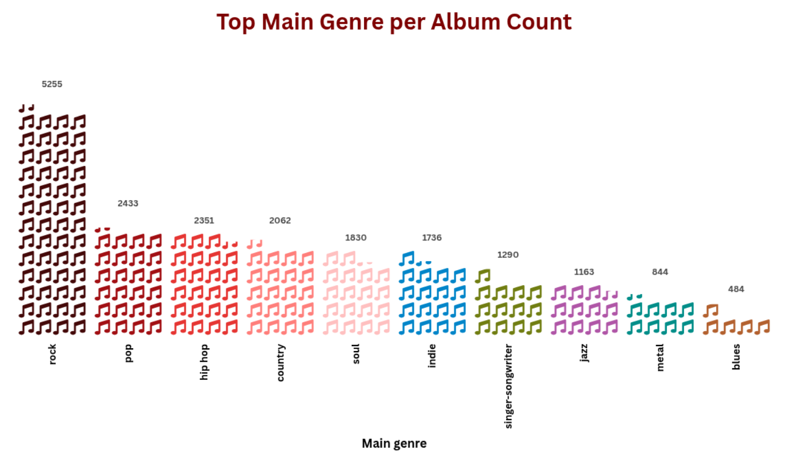
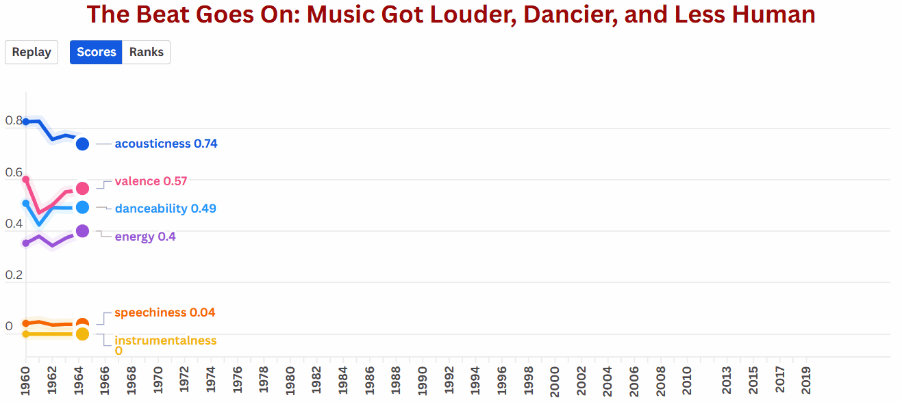

# 🎶 OK Computer, Map My Sound  
*A Data Science Diploma Capstone Project*  
**Institute:** The German University in Cairo, Egypt  

---

## 🧠 Project Overview

_“No Surprises”_ here — this project explores the evolution of music genres, subgenres, and audio features over the decades using data collected from multiple sources, including the **Spotify Web API** and the **Last.fm API**. Since Spotify’s genre data was limited (surprise surprise...), we leveraged Last.fm to fill in missing genre and subgenre classifications — making our dataset richer, cleaner, and more representative.

To orchestrate our workflow and ensure everything stayed _“In Its Right Place”_, we built a data pipeline using **Apache Airflow** and stored our processed data in **PostgreSQL**.

Our project is based on Billboard’s **Top 200 Albums of All Time**, providing a solid foundation for trend analysis across decades.

---

## 📊 Visual Highlights

### 🎨 Top 10 Genres Across Decades  
_A visual overview of the most dominant genres in each era._  

---

### 🔍 Audio Features Over Time  
How features like **acousticness**, **danceability**, **valence**, **energy**, **speechiness** and **instrumentalness** evolved.  

---

### 🎭 Genre & Subgenre Evolution  
Patterns in genre diversification and crossover trends.  

---

## 🧑‍🤝‍🧑 Meet the Team

This project was made possible by an incredible group of collaborators:

- **Nadeen** – our datahead and GUC's Kid A.I, PHD student, whose powerful EDA and analysis _"pulled of out of an air crash"_ situation.
- **Tarek** – our _“Man of War”_, who applied clustering techniques from our ML coursework to identify deep genre/subgenre trends.
- **Menna** – created the beautiful **Flourish dashboard** you can explore [here](https://public.flourish.studio/visualisation/your_dashboard_link/).
- **Kareem** – orchestrated our workflow and ensure _“everything stayed In Its Right Place”_.
- **Ziad** – brought the data together and made sure there was no empty spaces inside the data for the weeds to take root.

---

## 🛠 Tools Used

- **Spotify Web API** + **Last.fm API**
- **Python**, **Pandas**, **Plotly**, **Seaborn**
- **Apache Airflow**
- **PostgreSQL**
- **Flourish Studio**

---

[Flourish Dashboard](https://public.flourish.studio/visualisation/your_dashboard_link/).

---

[Thank you](https://www.youtube.com/watch?v=Bf01riuiJWA)  

