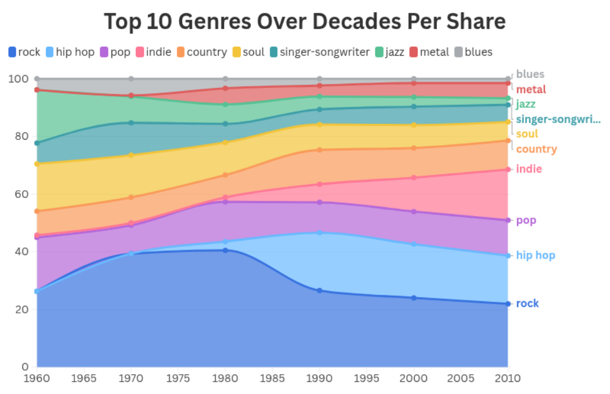

# 🎶 OK Computer, Map My Sound  
*A Data Science Diploma Capstone Project*  
**The German University in Cairo, Egypt**   

---

## 🧠 Project Overview

This project explores the evolution of music genres, subgenres, and audio features over the decades using data collected from multiple sources, including the **Spotify Web API** and the **Last.fm API**. Since Spotify’s genre data was limited (no surprises), we leveraged Last.fm to fill in missing genre and subgenre classifications making our dataset richer, cleaner, and more representative.

To orchestrate our workflow, we built a data pipeline using **Apache Airflow** and stored our processed data in **PostgreSQL**.

Our project is based on Billboard’s **Top 200 Albums of All Time**, providing a solid foundation for trend analysis across decades.

---

## 📊 Visual Highlights

### 🎶 Genre Analysis
_A visual of genre evolution._  

---

### 🎨 Top 10 Genres Across Decades  
_A visual overview of the most dominant genres in each era._  

---

### 🔍 Audio Features Over Time  
How features like **acousticness**, **danceability**, **valence**, **energy**, **speechiness** and **instrumentalness** evolved.  

---

### 🎭 Genre & Subgenre Evolution  
Patterns in genre diversification and crossover trends.  

---

## 🧑‍🤝‍🧑 Meet the Team

This project was made possible by an incredible group of collaborators:

- **Nadeen** – our datahead and GUC's Kid A.I, PHD student, whose powerful EDA and analysis _Pulled us out of an air crash_ situation.
- **Tarek** – our _Man of War_, who applied clustering techniques from our ML coursework to identify deep genre/subgenre trends.
- **Menna** – created the beautiful **Flourish dashboard** you can explore [here](https://public.flourish.studio/visualisation/your_dashboard_link/).
- **Kareem** – orchestrated our workflow and ensure _everything stayed In Its Right Place_.
- **Ziad** – brought the data together and made sure there was no empty spaces inside the data for the weeds to take root.

---

## 🛠 Tools Used

- **Spotify Web API** + **Last.fm API**
- **Python**, **Pandas**, **Plotly**, **Seaborn**
- **Apache Airflow**
- **PostgreSQL**
- **Flourish Studio**

---

[Flourish Dashboard](https://public.flourish.studio/visualisation/your_dashboard_link/).

---

[Thank you](https://www.youtube.com/watch?v=Bf01riuiJWA)  

